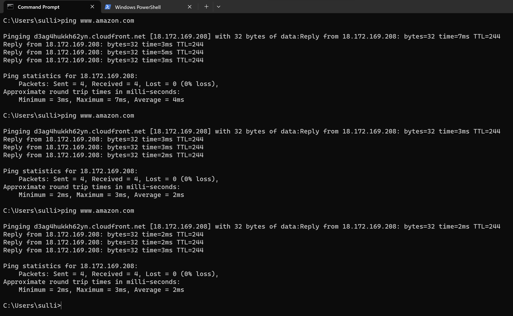
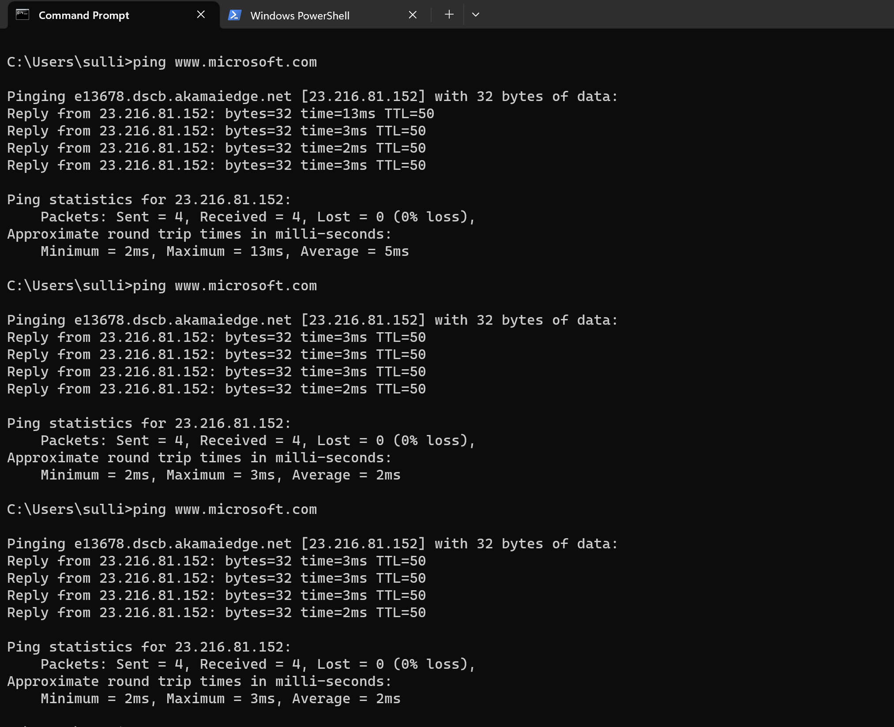
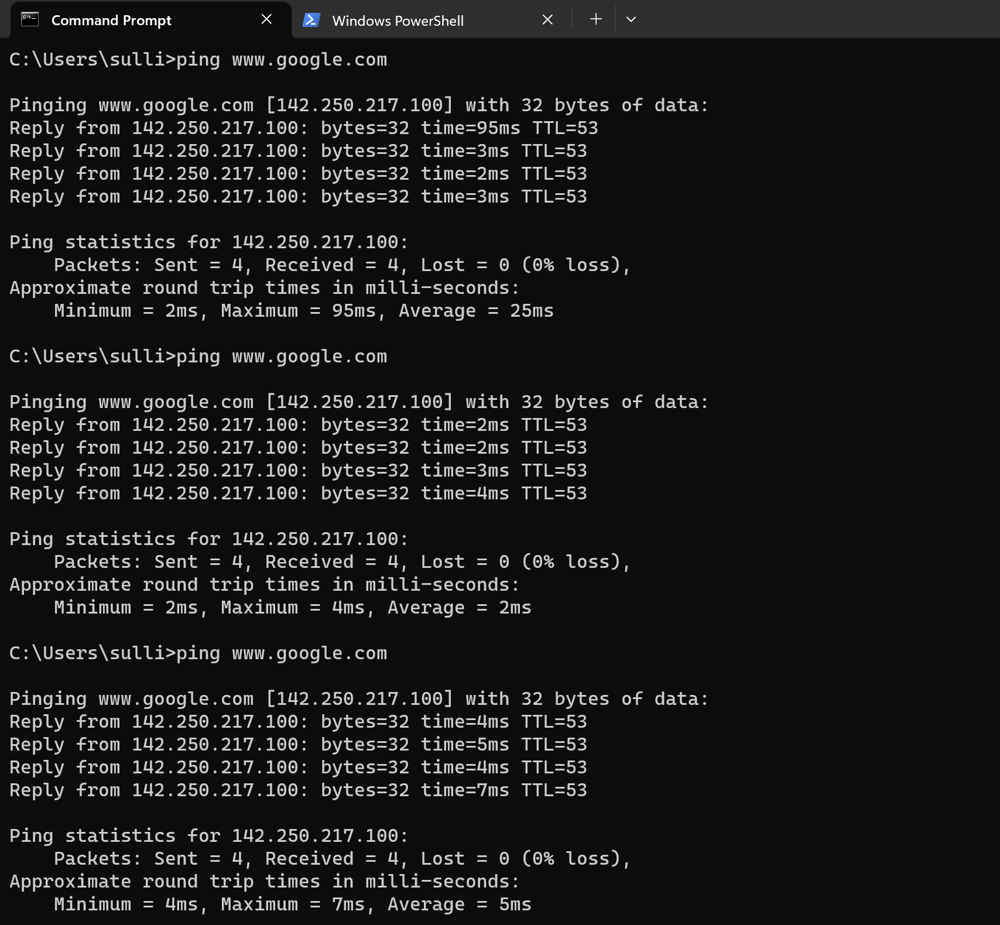
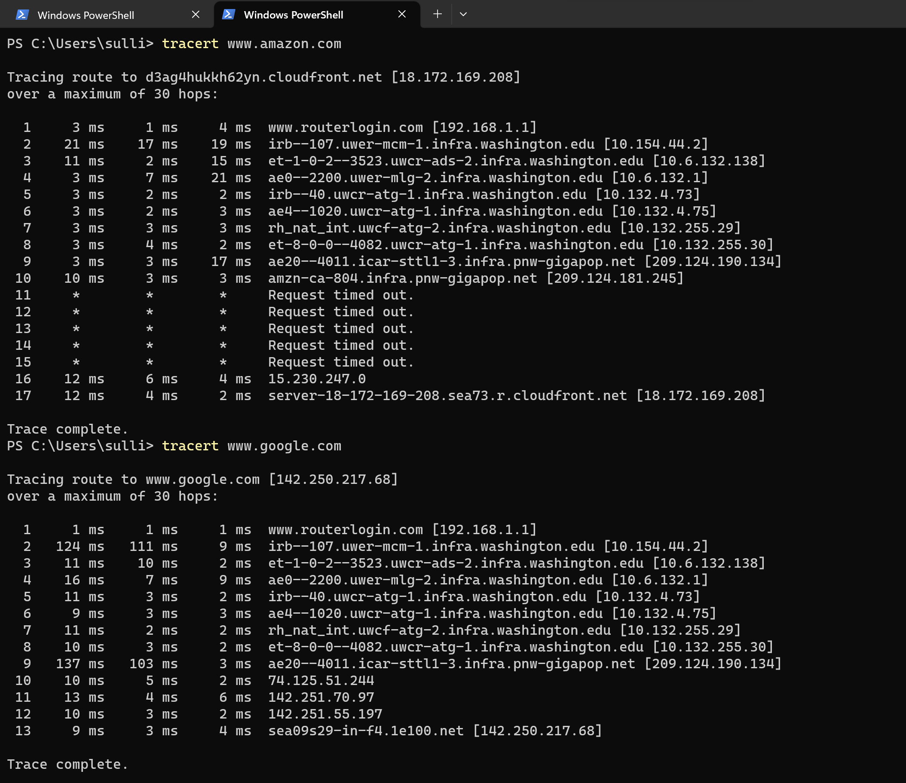
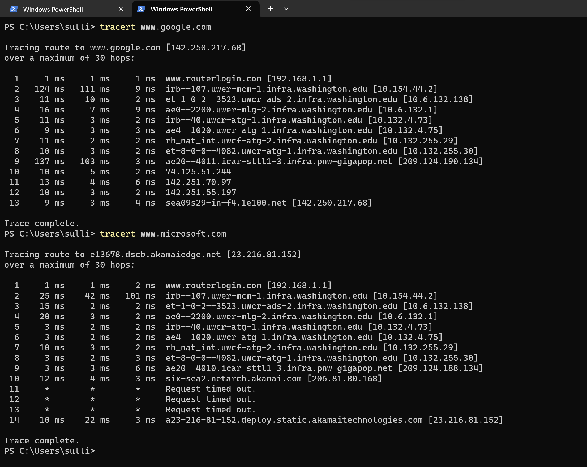

# tcptools

## Using "ping" on three popular websites - Screenshots

# Questions:
## What were the min/avg/max/stddev statistics for each?
Amazon: min = 2ms, avg = 25ms, max = 95ms, 
## Was there any packet loss on any of the pings?
There was 0% packet loss for each of the three websites that were pinged 
(Amazon, Microsoft, and Google).
## Did the IP address change for a given website between pings?
The IP address did not change for a given website between pings

---

## Using "tracert" on the given sites - Screenshots

# Questions:

## What was the target server's IP address?

Amazon's target server IP address = 18.172.169.208

Microsoft's target server IP address = 23.216.81.152

Google's target server IP address = 142.250.217.68

## How many hops were needed to reach the target?
It took 17 hops to reach the target for Amazon

It took 14 hops to reach the target for Microsoft

It took 13 hops to reach the target for Google

## Can you identify your ISP from the intermediate server DNS names?
It identified my router as Linksys using the DNS name, if that counts

## Identify the "class" of IP address for each major step in the trip
My IP address class is class C with an IP address of 192.168.1

Amazon's final IP address from my trip is class A with an IP address of 18.172.169.208

Microsoft's final IP address from my trip is class A with an IP address of 23.216.81.152

Google's final IP address from my trip is class B with an IP address of 142.250.217.68